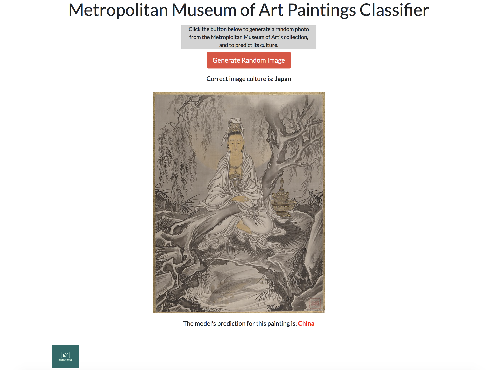

# Met Image Classification
Image classification of the art archives from the Metropolitan Museum of Art in New York.

## About the Project
The goal of this project is to apply machine learning to the treasure trove of freely available data from the Metropolitan Museum of Art in New York City. "The Met", as the museum is commonly called, has a [free web API](https://metmuseum.github.io). The dataset contains metadata about the works of art (year created, country of origin, artist, etc). Many of the datapoints also contain a link to an image of the item.

A sampling of the images from this dataset is shown below.

Using the data for paintings contained in the dataset, the goal of the project was to predict from which of 4 possible countries a painting came: **China, Japan, America** or **India**, using only the image pixels as input data (i.e., not including any metadata as input).

Once the model was trained, the next step in the project was to create an interactive front-end of this classifier, using Plotly Dash. A screenshot of this front-end application is shown below.

### Running the Code
To download the dataset used in training the classifier, run `python3 data_acquisition/api_access.py`.

To train the paintings classifier, run `python3 model_training/paintings_model_training.py`.

To start up the Dash app locally, run `python3 dash_app/app.py`.

### The Paintings Classifier Web App
You can check out the final app [here](https://met-paintings-classifier.herokuapp.com).
The code for the app, built in Plotly Dash, is found in the folder `./app/`

### More Info
For more information about this project, see the medium posts about it:
